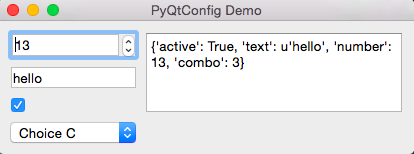
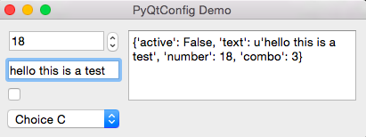

PyQtConfig
==========

PyQtConfig is a simple API for handling, persisting and synchronising configuration 
within PyQt applications.



Features
--------

- consistent interface to read values from widgets, always `get` and `set`
- seamlessly handle conversion of types from QSettings strings
- integrated mapping handles conversions between display and internal settings, e.g. nice text in combo boxes to integer values
- save and load configuration via `dict` (to JSON) or `XML`
- BSD licensed

Introduction
------------

The core of the API is a `ConfigManager` instance that holds configuration settings (either
as a Python dict, or a QSettings instance) and provides standard methods to `get` and `set`
values. 

Configuration parameters can have Qt widgets attached as *handlers*. Once attached the widget
and the configuration value will be kept in sync. Setting the value on the `ConfigManager` will
update any attached widgets and changes to the value on the widget will be reflected immmediately
in the `ConfigManager`. Qt signals are emitted on each update.

Default values can be set and will be returned transparently if a parameter remains unset. 
The current state of config can be saved and reloaded via XML or exported to a flat dict.

A small application has been included in PyQtConfig to demonstrate these features (interaction
with widgets requires a running QApplication). Go to the pyqtconfig install folder and run it with:

```
python -m pyqtconfig.demo
```





Simple usage (dictionary)
-------------------------

To store your settings you need to create a `ConfigManager` instance. This consists of a
settings dictionary, a default settings dictionary and a number of helper functions to
handle setting, getting and other functions. 

```python
from pyqtconfig import ConfigManager

config = ConfigManager()

config.set_defaults({
    'number': 13,
    'text': 'hello',
    'array': ['1','2'],
    'active': True,
    
})
```

Before values are set the default value will be returned when queried.

```python
config.get('number')
13

config.set('number', 42)
config.get('number')
42
```

Simple usage (QSettings)
-------------------------

The `QSettingsManager` provides exactly the same API as the standard `QConfigManager`, the 
only difference is in the storage of values.

```python
from pyqtconfig import QSettingsManager

settings = QSettingsManager()

settings.set('number', 42)
settings.set('text', "bla")
settings.set('array', ["a", "b"])
settings.set('active', True)

settings.get('number')
>> 42
```

Note: On some platforms, versions of Qt, or Qt APIs QSettings will return strings for all values
which can lead to complicated code and breakage. However, PyQtConfig is smart enough to 
use the `type` of the config parameter in defaults to auto-convert returned values. 

However, you do not have to set defaults manually. As of v0.7 default values are auto-set when 
attaching widgets (handlers) to the config manager *if they're not already set*.

From this point on we'll be referring to the `ConfigManager` class only, but all features 
work identically in `QSettingsManager`.

Adding widget handlers
-----------------------

So far we could have achieved the same thing with a standard Python dict/QSettings object.
The real usefulness of PyQtConfig is in the ability to interact with QWidgets maintaining
synchronisation between widgets and internal config, and providing a simple standard 
interface to retrieve values.

Note: It's difficult to demonstrate the functionality since you need a running QApplication
to make it work, and you can't do that in the interactive interpreter. The examples that
follow are contrived outputs that you would see *if it were possible to do that*. For a real
example, see the demo included in the package.

```python
lineEdit = QtGui.QLineEdit()
config.add_handler('text', lineEdit)

checkbox = QtGui.QCheckBox('active')
config.add_handler('active', checkbox)
```


The values of the widgets are automatically set to the pre-set defaults. Note that if we
hadn't pre-set a default value the *reverse* would happen, and the default would be set 
to the value in the widget. This allows you to define the defaults in either way.

Next we'll change the value of both widgets.

We can read out the values of the widgets via the `ConfigManager` using the standard `get` interface
rather than using the widget-specific access functions.

```python
config.get('text')
>> 'hello'

config.get('active')
>> True
```

We can also update the widgets via the `ConfigManager` using `set`.

```python
config.set('text', 'new value')
config.set('active', False)
```


    
Mapping
-------

Sometimes you want to display a different value in a widget than you store in the configuration.
The most obvious example would be in a combo box where you want to list nice descriptive
names, but want to store short names or numbers in the configuration.

To enable this PyQtConfig allows a `mapper` to be defined when attaching a widget to a config. 
Mappers are provided as tuple of 2 functions `set` and `get` that each perform the conversion
required when setting and getting the value from the widget. To simplify map creation however
you can also specify the mapping as a dict and PyQtConfig will create the necessary lambdas
behind the scenes.

```python
CHOICE_A = 1
CHOICE_B = 2
CHOICE_C = 3
CHOICE_D = 4

map_dict = {
    'Choice A': CHOICE_A,
    'Choice B': CHOICE_B,
    'Choice C': CHOICE_C,
    'Choice D': CHOICE_D,
}

config.set_default('combo', CHOICE_C)
config.get('combo')
>> 3

comboBox = QtGui.QComboBox()
comboBox.addItems( map_dict.keys() )
config.add_handler('combo', comboBox, mapper=map_dict)
```


Note how the config is set to `3` (the value of `CHOICE_C`) but displays "Choice C" as text.

Supported Widgets
-----------------
The following Qt-Widgets are supported:

 - QComboBox
 - QCheckBox
 - QAction
 - QActionGroup
 - QPushButton
 - QSpinBox
 - QDoubleSpinBox
 - QPlainTextEdit
 - QLineEdit
 - QListWidget
 - QSlider
 - QButtonGroup
 
There are also some additional hooks defined for non standard widgets. With
```python
import pyqtconfig
print(pyqtconfig.HOOKS.keys())
```
you can obtain a list of all registered Widgets. Adding support for your own widget is also straight forward:
```python
from pyqtconfig import ConfigManager

def _get_MyWidget(self):
    return self.myvalue
   
def _set_MyWidget(self, val):
    self.myvalue = val
	
def _event_MyWidget(self):
    return self.MyValueChanged

config = ConfigManager()
config.add_hooks('MyWidget', (_get_MyWidget, _set_MyWidget, _event_MyWidget))
```


Saving and loading data
-----------------------

`QSettingsManager` uses a `QSettings` object as a config store and so the saving of configuration is
automatic through the Qt APIs.  However, if you're using `ConfigManager` you will need another
approach to load and save your settings (note that these functions are also available in
`QSettingsManager` if you want them).

The simplest access is to output the stored data as a `dict` using `as_dict()`.

```python
config.as_dict()
```

This dict contains all values in the internal dictionary, with defaults used where values are not set.
You can take this dict and set the defaults on a new `ConfigManager` to persist state.

```python
config2 = ConfigManager()
config2.set_defaults( config.as_dict() )

config2.get('combo')
>> 3
```
    
You can also export and import data as XML. The two functions for handling XML import take an
`ElementTree` root element and search for config settings under `Config/ConfigSetting`. This allows
you to use PyQtConfig to write config into an XML file without worrying about the format.

```python
import ElementTree as et

config.set('combo', CHOICE_D)

root = et.Element("MyXML")
root = config.getXMLConfig( root )

config2.setXMLConfig(root)
config2.get('combo')
>> 4
```
    
Acknowledgements
----------------

Thanks to [Pirmin Kalberer](https://github.com/pka) for starting this documentation that I had forgot about entirely.

Bug reports and pull-requests are most welcome.


